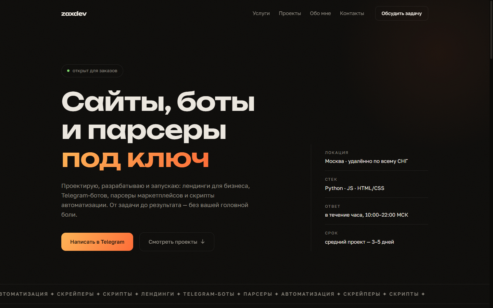
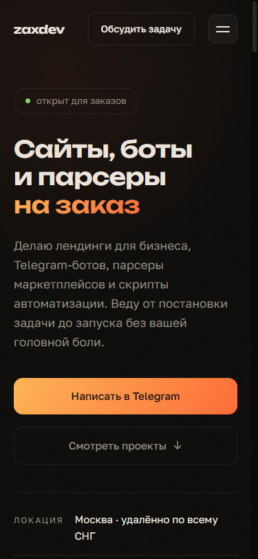

# zaxdev-portfolio

Одностраничный сайт-портфолио: тёмная тема и glassmorphism, чистый HTML/CSS/JS. Без фреймворков и сборщиков — открывается как есть.

**Живой сайт:** [hmsusbusas-png.github.io/zaxdev-portfolio](https://hmsusbusas-png.github.io/zaxdev-portfolio/)

## Что на странице

- Hero — асимметричная сетка, колонка фактов и бегущая строка услуг
- Услуги — bento-сетка с прожектором, который следует за курсором
- Проекты — четыре крупных ряда со скриншотами и компактная сетка остальных работ (у живых сайтов — превью, у python-тулов — чип)
- Обо мне — короткая история и таймлайн
- Контакты — CTA с рисованной стрелкой и магнитной кнопкой

Сверху лёгкое «зерно» (SVG-шум), чтобы фон не выглядел пластиковым. Блоки появляются при скролле (IntersectionObserver), навигация прячется при скролле вниз, свои ::selection и скроллбар, уважается `prefers-reduced-motion`. Шрифты — [Unbounded](https://fonts.google.com/specimen/Unbounded) и [Golos Text](https://fonts.google.com/specimen/Golos+Text), оба с кириллицей.

## Скриншоты





## Как запустить

Сборка не нужна. Откройте `index.html` в браузере или поднимите любой статический сервер:

```bash
python -m http.server 8000
# → http://localhost:8000
```

## Структура

```
├── index.html        # вся разметка
├── css/style.css     # стили, обычный CSS без препроцессора
├── js/main.js        # анимации, без зависимостей
├── img/projects/     # скриншоты проектов для страницы
├── screenshots/      # скриншоты самого сайта
└── favicon.svg
```

Связь: Telegram [@lev_backend](https://t.me/lev_backend).

---

<details>
<summary>EN</summary>

One-page portfolio site: dark theme, glassmorphism, plain HTML/CSS/JS. No frameworks, no build step — open `index.html` and it works.

**Live:** [hmsusbusas-png.github.io/zaxdev-portfolio](https://hmsusbusas-png.github.io/zaxdev-portfolio/)

Orders: Telegram [@lev_backend](https://t.me/lev_backend).

</details>
